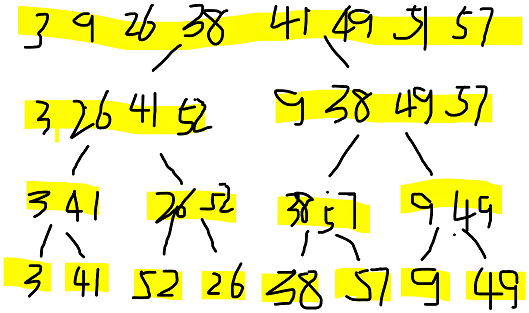
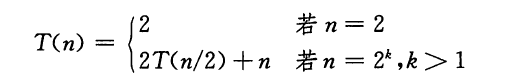

## 练习 2.3：

2.3-1 使用图2-4做为模型，说明递归排序在数组A=<3,41,52,26,38,57,9,49>上的操作；

> EN

Using Figure 2.4 as a model, illustrate the operation of merge sort on the array
A=<3,41,52,26,38,57,9,49>.

> 说明



2.3-2 重写MERGE过程，使之不使用哨兵(sentinel)，而是一旦数组L或R的所有元素均被复制回A就立刻停止。然后把另一个数组的剩余部分复制回A。

> EN

Rewrite the MERGE procedure so that it does not use sentinels, instead stopping
once either array L or R has had all its elements copied back to A and then copying
the remainder of the other array back into A.

> 伪代码
```
MERGE(A, p, q, r):
    L = A[p..q]
    R = A[q + 1..r]
    n1 = q - p + 1
    n2 = r - q
    let L[1..n1] and R[1..n2] be new arrays
    // 复制数组
    for i = 1 to n1
        L[i] = A[p + i - 1]
    for j = 1 to n2
        R[j] = A[q + j]

    i = 1
    j = 1
    
    for k = p to r
        if i > n1:
            // 将R剩下的拷贝到A中
            A[k] = R[j]
            j = j + 1
        else if j > n2:
            // 将L剩下的拷贝到A中
            A[k] = L[i]
            i = i + 1
        else if L[i] ≤ R[j]
            A[k] = L[i]
            i = i + 1
        else
            A[k] = R[j]
            j = j + 1
```

2.3-3 使用数学归纳法(mathematical induction)证明：当n正好是2的幂时，以下递归式的解是T(n)=nlgn。



> EN

Use mathematical induction to show that when n is an exact power of 2, the solution
of the recurrence

> 证明

证明：当n=2时，根据递归式T(n) = 2 = 2lg2，递归式成立；

假设：当n=2^k时，递归式成立，有T(n) = 2T(n/2)+n = nlgn = 2^klg2^k = k*2^k

证明：当n=2^(k+1)时，递归式成立：
T(2^(k+1)) = 2T((2^(k+1))/2)+2^(k+1)
         = 2T(2^k)+2^(k+1)
         = 2*(k*2^k)+2^(k+1)
         = (k+1)*2^(k+1)
         = (k+1)lg2^(k+1)

结论： 当n正好是2的幂时，递归式的解是T(n)=nlgn。