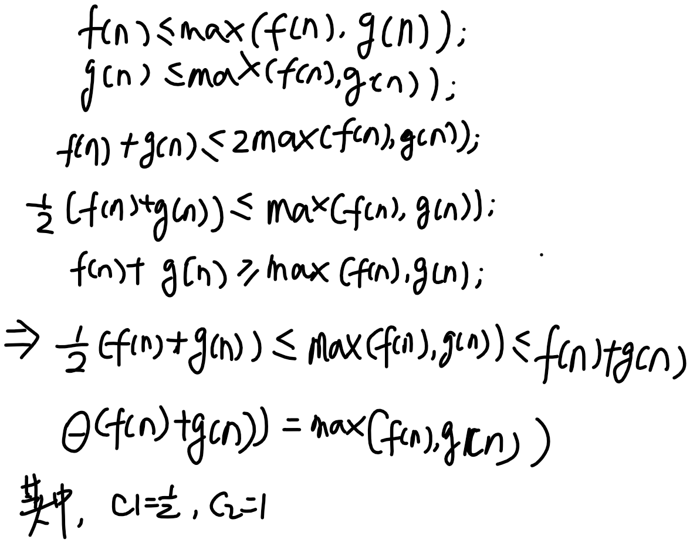
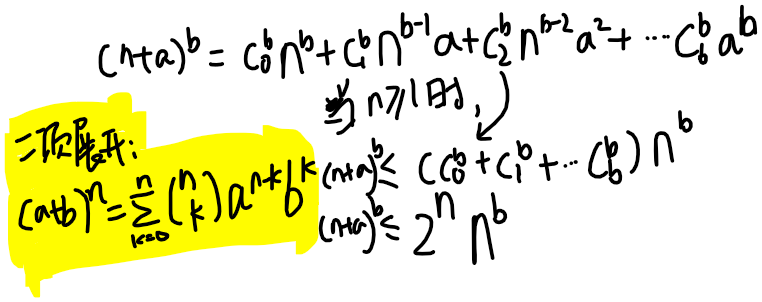
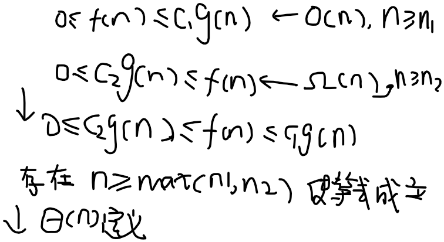

## 练习 3.1：

**3.1-1** 假设f(n)与g(n)都是渐进非负函数。使用Θ记号的基本定义来证明max(f(n),g(n))=Θ(f(n)+g(n))



**3.1-2** 证明：对任意实常量a和b，其中b>0，有 (n+a)^b=Θ(n^b)

> 解答

(n+a)^b可以化为二项式：n^b+b*n^(b-1)a+...a^b, 舍弃低次项可得Θ(n^b)




> 参考
- [二项式展开(Binomial Expantion)](https://www.shuxuele.com/algebra/binomial-theorem.html)

- [二项式展开(Binomial Expantion)](https://studywell.com/maths/pure-maths/sequences-series/binomial-expansion/)


**3.1-3** 解释为什么“算法A的运行时间至少是O(n^2)”这一表述是无意义的。

> 解答

O代表的是运行时间上界，“至少”代表的是下界。

这句话的意思可以是：你可以花至少100块钱或更少。（没有意义的信息）

参考:
- https://cs.stackexchange.com/questions/71149/why-is-it-meaningless-to-say-the-runtime-of-an-algorithm-is-at-least-in-the-orde

- https://www.slader.com/discussion/question/explain-why-the-statement-the-running-time-of-algorithm-a-is-at-least-on2-is-meaningless/


**3.1-4** 2^(n+1)=O(2^n)成立吗？ 2^(2n)=O(2^n)成立吗？

> 解答

- 1 ***成立**

    0=< 2^(n+1) <= c*2^n, 2边同时除以 2^n

    0=< 2 <= c

    所以存在c>=2, n为任意自然数不等式成立；

- 2 ***不成立**
    0=< 2^(2n) <= c*2^n, 2边同时除以 2^n;

    0=< 2^n <= c

    不存在一个常量c使不等式成立


**3.1-5** 证明定理3.1

```
定理3.1 对任意两个函数 f(n)和g(n)，我们有f(n) = Θ(g(n))，当且仅当f(n)=O(g(n)) 且 f(n)=Ω(g(n))
```

> 解答

合并不等式，取n最大值




**3.1-6** 证明：一个算法的运行时间为 Θ(g(n))，当且晋档其最坏情况运行时间是O(g(n))，且其最好情况运行时间为Ω(g(n))

> 解答

证明方法 如3.1-5。可以将运行时间T(n)假设为f(n)

**3.1-7** 证明o(g(n)) ∩ w(g(n)) 是空集

> 解答

这里的小o(little-oh of g of n)，小w(little-omega of g of n) 代表非渐近紧确(not asymptotically tight)


